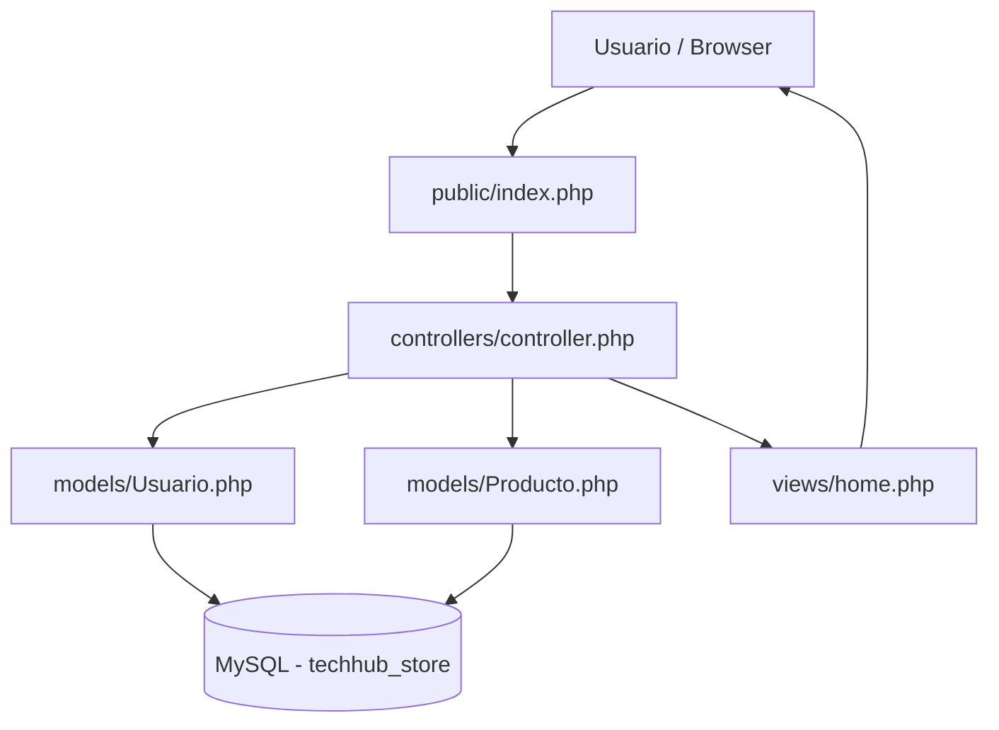

# Proyecto E-commerce

## Descripción
Sistema básico de tienda online desarrollado en PHP con arquitectura MVC.

## Tecnologías utilizadas
- PHP
- MySQL
- XAMPP
- HTML

## Funcionalidades
- Login de usuario
- Listado de productos
- Carrito de compras con sesiones
- Conexión a base de datos con PDO

## Instalación

1. Clonar repositorio: `git clone https://github.com/Nattanohj/E-commerce`
2. Mover carpeta a: `C:\xampp\htdocs\`
3. Crear base de datos en phpMyAdmin: `techhub_store`
4. Importar archivo `.sql`
5. Iniciar XAMPP: Apache + MySQL
6. Acceder: `http://localhost/techhub_store/public/`

## Credenciales
- **Email:** jhonattan@email.com
- **Password:** 123456

## Diagrama de Arquitectura MVC

## Funciones Principales

| Archivo | Función / Acción | Descripción |
|---|---|---|
| `models/Usuario.php` | `login()` | Valida email y password contra la BD, retorna datos del usuario |
| `models/Producto.php` | `listar()` | Retorna todos los productos disponibles en la BD |
| `config/database.php` | `conectar()` | Establece la conexión PDO con MySQL |
| `public/index.php` | `?agregar=ID` | Agrega un producto al carrito almacenado en sesión |
| `public/index.php` | `?vaciar=true` | Elimina todos los productos del carrito de la sesión |

## Integrantes
-Jhonattan Lobos   
-Antonella Soto
-Jeraldyn Zenteno
-Matias Maimae
-Eladio rojas